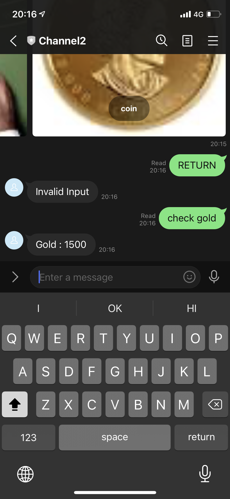
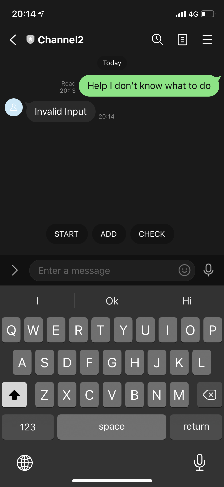
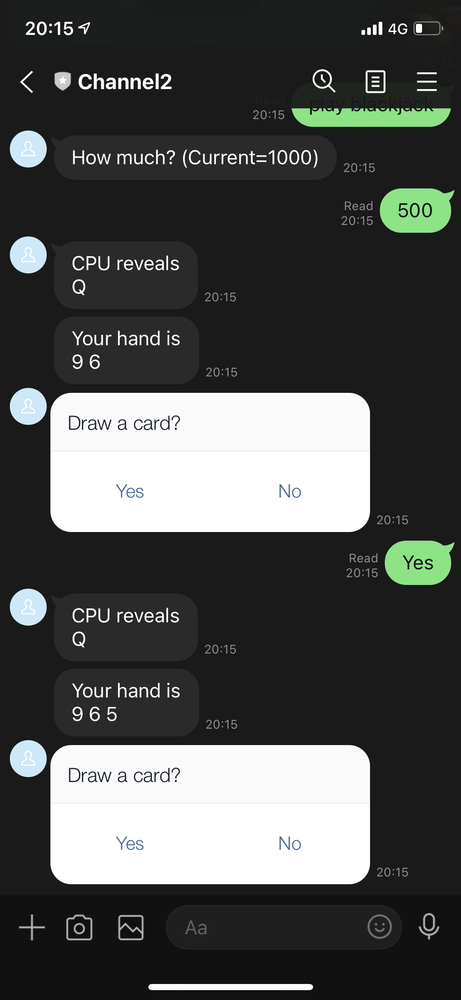
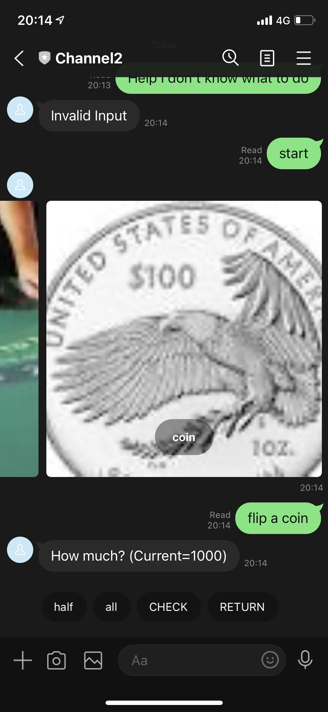
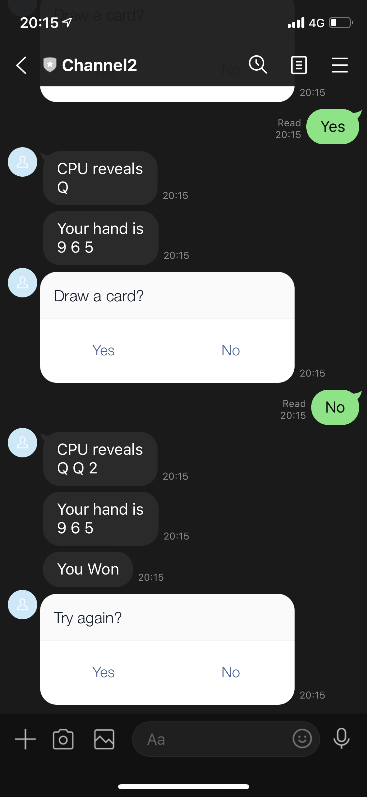

### Theory Of Computation Line Bot
Built with LINE Messaging API, implemented with python using pytransition to create finite state machines.   

#### Additions
On top of the [template](https://github.com/NCKU-CCS/TOC-Project-2020), some features had been added into the project.  
Which includes
- Actual States that serves a purpose for the finite state machine (Check : fsm.py)
- Functions to push different message types to the user interface (Check : utils.py), as well as a quick-reply feature and `check_state()` function in case of the user get lost in states
- A very simple function to test capability of web-scraping using BeautifulSoup (Check : scraper.py)
- Deploy the program application on Cloud Application Platform [Heroku](https://www.heroku.com)
- A dictionary that keep tracks of `{source.user_id}` to save states for different users.

#### Screenshots
**FSM**

**LineBot can send proper message**

**Quick Reply**

**MessageTemplate that is not TextMessage**

**Display images using top search result 'coin'**

**Function that is implemented with more than 2 states**

#### Add Friend

